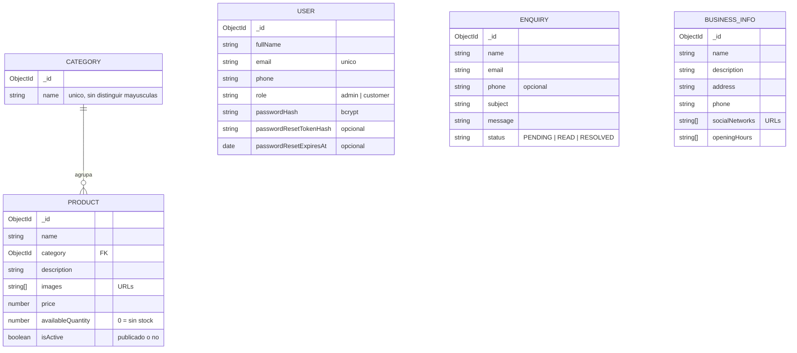

# Modelo de datos

La base es MongoDB. Cada entidad es una colección; todas tienen `createdAt` y
`updatedAt`, y la API expone el `_id` como `id`. Los modelos están en
`src/models`.

## Colecciones

**categories**: las categorías del catálogo. Tienen un índice único sobre
`name` con collation `es` de fuerza 2, así que "Consolas" y "consolas" cuentan
como el mismo nombre.

**products**: las publicaciones. `category` referencia a una categoría que
tiene que existir, y una categoría no se puede borrar mientras tenga productos.
Tienen un índice de Atlas Search (`productSearch`) para la búsqueda por texto,
con los filtros por categoría, precio y estado.

**users**: las cuentas. `email` se guarda en minúsculas y tiene índice único.
La contraseña y el token de recuperación se guardan hasheados y nunca salen en
las respuestas.

**enquiries**: las consultas del formulario de contacto. Arrancan en
`PENDING`; pueden pasar a `READ` o `RESOLVED` y siempre volver a `PENDING`,
pero una `RESOLVED` no pasa a `READ`.

**businessinfos**: la información institucional. Hay un único documento, que se
crea o reemplaza con `PUT /api/business-info`.

## Creación de la base

MongoDB crea las colecciones al insertar el primer documento, y los índices
salen de los modelos. `npm run seed` carga los datos de demostración y crea el
índice de Atlas Search (ver el README).
